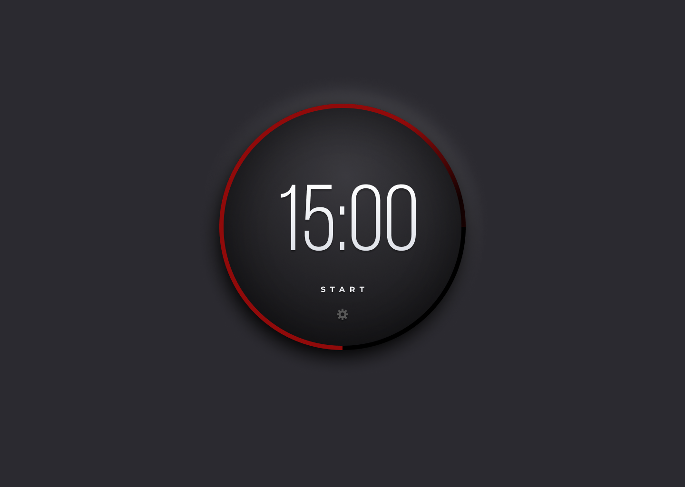
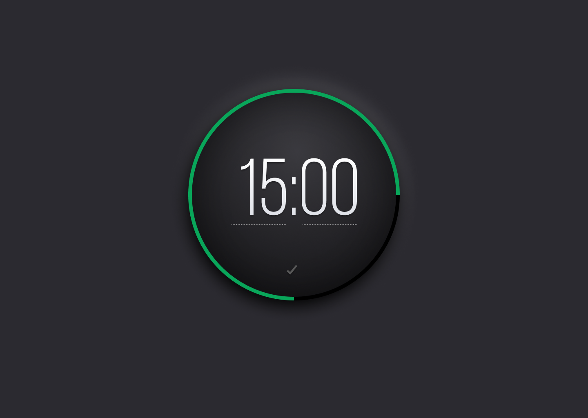

# 2022 Advent CSS / JS Day 1 - Pomodoro Timer
Users should be able to:
- Start the timer by clicking on the start link/button.
- Once the user clicks start, the word start will change to stop. Then, the user can click on the stop button to make the timer stop.
- Click on the gear icon to change the length (minutes and seconds) of the timer.
- Once the timer finishes, the ring should change from green to red and an alert message is passed to the browser.

## Designs
### Timer - Start

### Timer - Stop

### Timer - Edit
